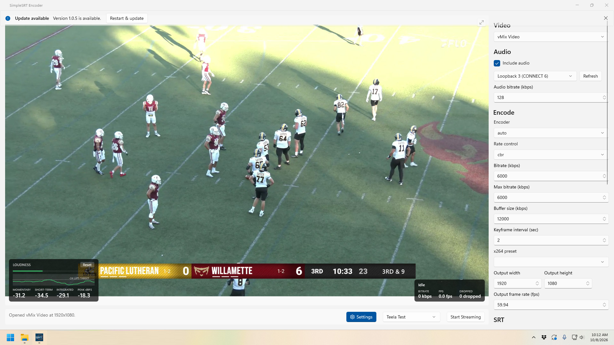
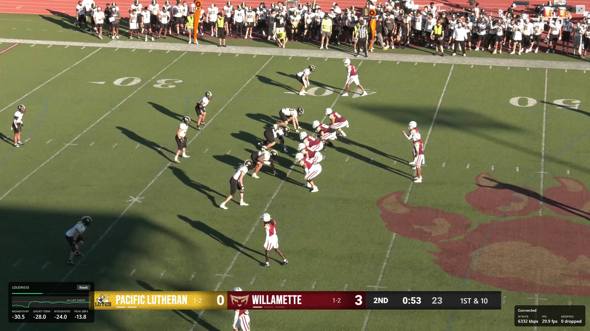

# SimpleSRT Encoder

A Windows desktop app for live SRT streaming from UVC, DirectShow (virtual cameras like
OBS/vMix), Blackmagic DeckLink, and NDI video sources — with a live preview, loudness
metering, hardware-accelerated encoding, and saved presets.



## Features

- **Capture backends**: UVC (Media Foundation), DirectShow virtual cameras (OBS Virtual
  Camera, vMix Video, etc.), Blackmagic DeckLink, and NDI. DeckLink/NDI are optional —
  see [Optional capture backends](#optional-capture-backends) below.
- **Live preview** with a fullscreen mode (double-click the preview, or `F11`/`Esc`).
- **Audio**: pick any WASAPI input device, or use a capture source's embedded audio
  (DeckLink SDI/HDMI). A loudness meter (momentary/short-term/integrated LUFS, with a
  history graph) overlays the preview.
- **Encoding**: hardware encoders (NVENC, QSV, AMF) with automatic fallback to `libx264`
  if a machine can't actually use the requested one at runtime — not just whether ffmpeg
  was compiled with it. CBR or VBR rate control, configurable bitrate/keyframe
  interval/output resolution and frame rate.
- **SRT**: caller, listener, or rendezvous mode, with optional passphrase (encrypted at
  rest via Windows DPAPI), stream ID, and latency.
- **Presets**: save/load full device + encode + SRT configurations.
- **Auto-updating**: ships via [Velopack](https://velopack.io) — checks for and installs
  updates from [GitHub Releases](https://github.com/chrissabato/simple-srt-encoder/releases)
  on startup.



## Installing

Download the latest installer from the
[Releases page](https://github.com/chrissabato/simple-srt-encoder/releases/latest)
(`SimpleSrtEncoder-win-Setup.exe`). The app checks for updates on startup and offers to
install them in place.

## Prerequisites (for building from source)

- **.NET SDK 10+** — already installed if `dotnet --version` works.
- **Visual Studio 2022/2026 with the "Desktop development with C++" workload** — needed to
  build `native/` (brings CMake + Ninja). Check via the Visual Studio Installer; without
  it, `cmake`/`ninja` won't be on PATH.
  - Without this installed, you can still build/run the UI-only app with
    `./build.ps1 -SkipNative` — it'll show a fallback message instead of talking to the
    native core.

## Build

```powershell
./build.ps1                  # builds native/ then ui/SimpleSrtEncoder (Debug)
./build.ps1 -Configuration Release
./build.ps1 -SkipNative      # UI only, if the C++ toolchain isn't installed
```

## Run

```powershell
dotnet run --project ui/SimpleSrtEncoder/SimpleSrtEncoder.csproj -p:Platform=x64
```

## Optional capture backends

DeckLink and NDI support require their (proprietary, separately licensed) SDKs. The app
builds and runs with UVC/DirectShow support only until you add them — see
`native/vendor/README.md` for where to drop them (or set `DECKLINK_SDK_DIR` /
`NDI_SDK_DIR`). No code changes are needed; the next CMake configure picks them up
automatically.

## Releasing

See `release.ps1` for the signed Velopack release flow (`vpk pack` + `vpk upload github`).
Architecture and design notes live in `docs/architecture.md`.
